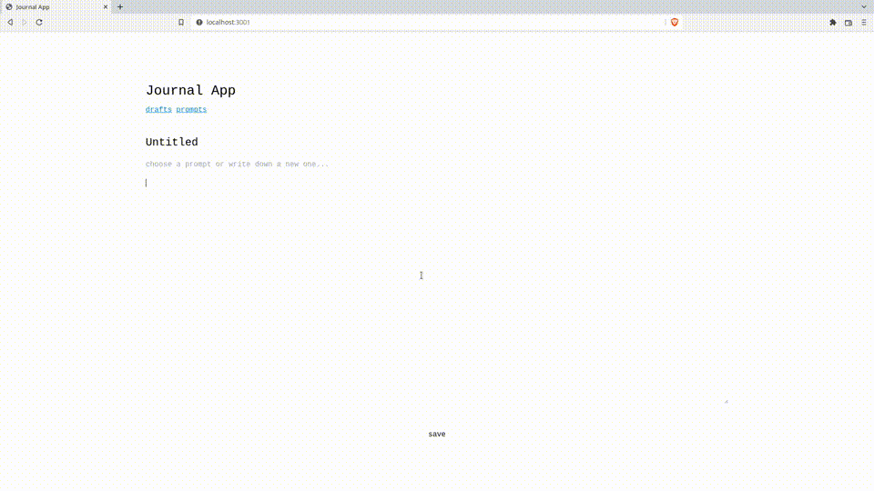

# Journal App Client

Journaling tool to save your notes/prompts and manage them separately.

[Server Repo](github.com/almeidavc/journal-app-server)

<!-- Overview + Technologies used -->

## Overview

Frontend for the journaling app. Implemented a single-page web application to interact with the backend. It consists of three views: a main view to create and edit notes and two other views to manage your notes/prompts. Built with:

- React
- React Router for the client side routing
- Tailwind CSS

<!-- App Demo -->

## App Demo

